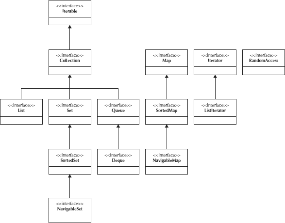

#  Java Collections
> - { `Iterable` {`Collecton`} , `Map`, `Iterator` , `RandomAccess` }
> 
> ---
>> Element , Sorted , Duplicate , Insert , Access , DynamicSize 
> ---
> 

---

# Java Map Interface
> _
> 
> ---
>> .
> ---
> 

---

# Collection
## an Object Group

>List
> > extends Collection
> > 1. Can Contain Duplicate
> > 2. Indexing
> ##### class implements 
> >  1. LinkedList
>  
> Set
> > extends Collection
>> 1. Can't Contain Duplicates
>> 2. 
> 
> 
> SortedSet
> >
> 
> Queue
> > 1. FIFO
> 
> Deque
> > 1. LIFO
> > 
>

> ## Iterator 
>> #### interface provides methods for iterating through the elements of a collection
> 
> for 
> 
> 
> fff
> fff
> ff
> 
