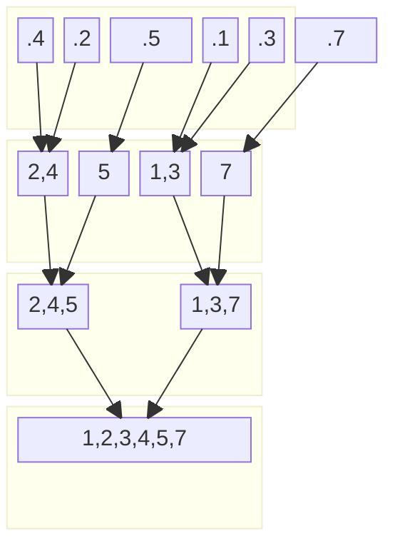

# Approach

## [1] Divide & Conquer

---
> [!NOTE] Array To Divide
> 

```mermaid
block-beta
    columns 1
    block: ID
        columns 1
        4,2,5,1,3,7:1
    end

    space

    block: ID1
        columns 3
        4,2,5:2 1,3,7:2
    end

    space

    block: ID2
        columns 8
        4,2:2 5:1 1,3:2 7:1
    end

    block: ID3
        columns 8
        .4:1 .2:1 .5:2 .1:1 .3:1 .7:2
    end

    ID --> 4,2,5
    ID --> 1,3,7
    
    4,2,5 --> 4,2
    4,2,5 --> 5
    
    1,3,7  --> 1,3
    1,3,7  --> 7
    
    4,2 --> .4
    4,2 --> .2
    5 --> .5
    
    1,3 --> .1
    1,3 --> .3
    7 --> .7


```
Conquer
- Merge And Sort

```mermaid
block-beta
    columns 1
    block: ID
        columns 8
        .4:1 .2:1 .5:2 .1:1 .3:1 .7:2
    end

    block: ID2
        columns auto
        2,4:2 5:1 1,3:2 7:1
    end
    block: ID3
        columns auto
        2,4,5:2 space:1 1,3,7:2
    end

    block: ID4
        columns auto
        1,2,3,4,5,7:2
    end

    .4-->2,4
    .2 -->2,4
    .5 --> 5
    .1 -->  1,3
    .3 -->  1,3
    .7 --> 7

2,4-->2,4,5
5 --> 2,4,5
1,3 --> 1,3,7
7 --> 1,3,7
2,4,5 --> 1,2,3,4,5,7
1,3,7 --> 1,2,3,4,5,7


```

---

## [1] Divide & Conquer
## [1] Divide & Conquer

