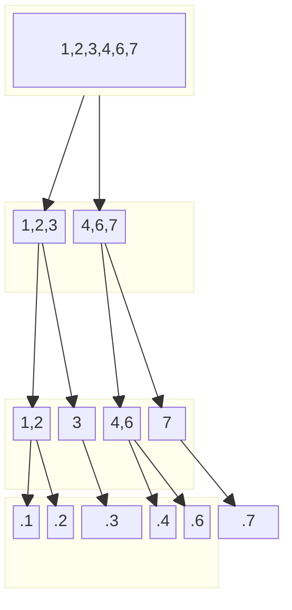

# Approach

## [1] Divide & Conquer

---
Divide To Array

```mermaid
block-beta
    
 columns 1   
    block: ID
        columns 1
        1,2,3,4,6,7:1
    end
    
 space
    
    block: ID1
        columns 3
       1,2,3:2 4,6,7:2
    end
    
    space
    
    block: ID2
        columns 8
        1,2:2 3:1 4,6:2 7:1 
    end

    block: ID3
        columns 8
        .1:1 .2:1 .3:2 .4:1 .6:1 .7:2
    end
    
    
ID --> 1,2,3
ID --> 4,6,7
1,2,3 --> 1,2
1,2,3 --> 3

4,6,7 --> 4,6
4,6,7 --> 7

1,2 --> .1
1,2 --> .2
3 --> .3
4,6 --> .4
4,6 --> .6
7 --> .7


```

---

## [1] Divide & Conquer
## [1] Divide & Conquer

