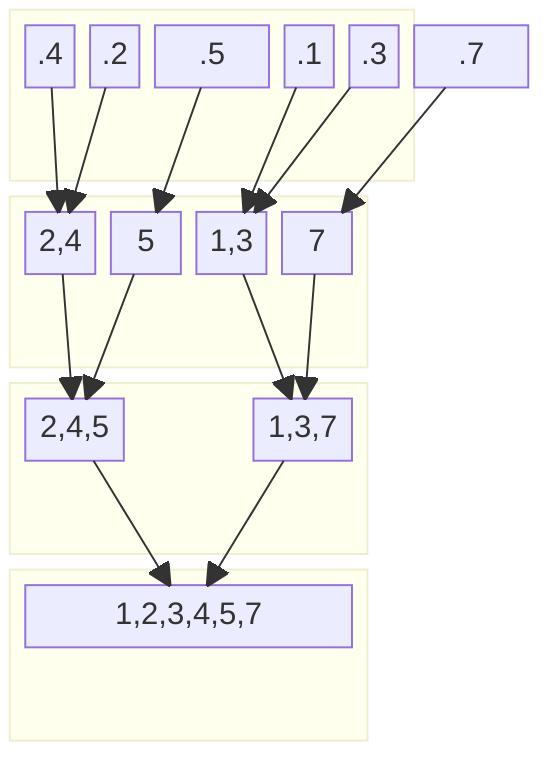
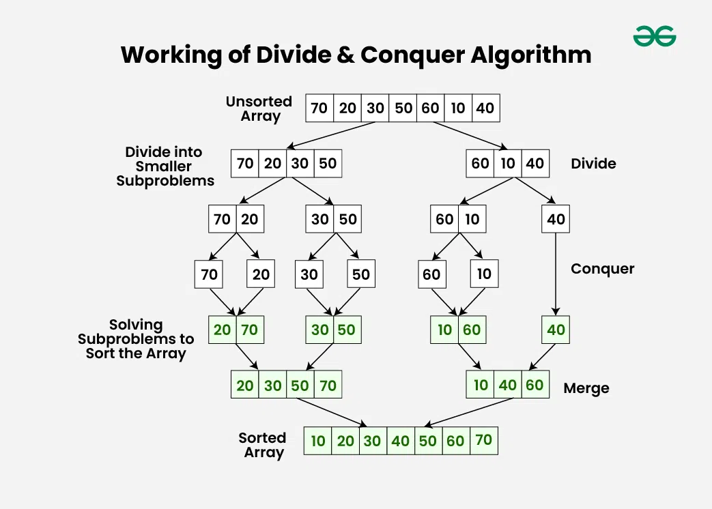

# Approach

## [1] Divide & Conquer

---

> [!NOTE]
> Array To Divide
>


> [!NOTE]
> Conquer
> - Merge And Sort



---



# Divide and Conquer algorithm?

 ### The main steps are:
> [!NOTE]
> ```
> - Algorithm : Merge Sort
> - Input : int[]
> - Output: int[] 
> ``` 
>
> 1. Divide: 
> > Break the problem into smaller subproblems.
> 2. Conquer: 
> > Solve the subproblems recursively.
> 3. Combine: 
> > Merge or combine the solutions of the subproblems to obtain the solution to the original problem.

<details>
<summary>toKorean</summary>

```
문제 나누기 : 문제를 더 작은 하위 문제로 나눕니다.
정복 (Conquer) : 하위 문제를 재귀적으로 해결합니다.
결합 : 하위 문제의 솔루션을 병합하거나 결합하여 원래 문제에 대한 솔루션을 얻습니다. 
```

</details>

---

## [1] Divide & Conquer

## [1] Divide & Conquer

