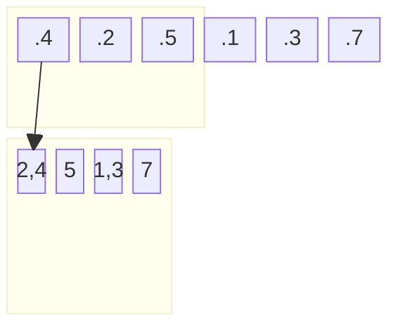

# Approach

## [1] Divide & Conquer

---
Array To Divide

```mermaid
block-beta
    columns 1
    block: ID
        columns 1
        4,2,5,1,3,7:1
    end

    space

    block: ID1
        columns 3
        4,2,5:2 1,3,7:2
    end

    space

    block: ID2
        columns 8
        4,2:2 5:1 1,3:2 7:1
    end

    block: ID3
        columns 8
        .4:1 .2:1 .5:2 .1:1 .3:1 .7:2
    end

    ID --> 4,2,5
    ID --> 1,3,7
    
    4,2,5 --> 4,2
    4,2,5 --> 5
    
    1,3,7  --> 1,3
    1,3,7  --> 7
    
    4,2 --> .4
    4,2 --> .2
    5 --> .5
    
    1,3 --> .1
    1,3 --> .3
    7 --> .7


```
Merge to Conquer

```mermaid
block-beta
    
 columns 1
    block: ID
        columns 12
        .4:2 .2:2 .5:2 .1:2 .3:2 .7:2
    end

    block: ID2
        columns auto
        2,4:3 5:3 1,3:3 7:3
    end
    
    
               .4-->2,4

  

```

---

## [1] Divide & Conquer
## [1] Divide & Conquer

