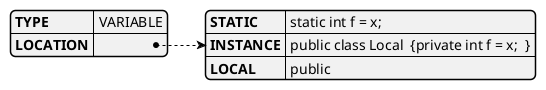
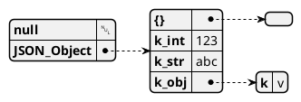
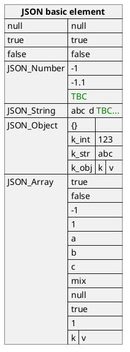
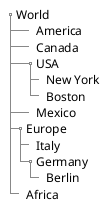
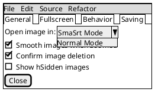
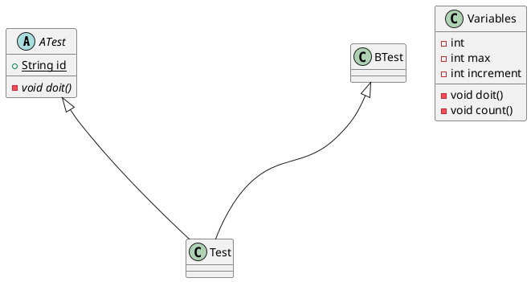

```plantuml
@startjson
{

"TYPE" : "VARIABLE",
"LOCATION": {

"STATIC":"static int f = x;",
"INSTANCE": "public class Local \n {private int f = x;  \n}",
"LOCAL":"public "

}

}


@endjson

```

```plantuml
@startjson
{
"null": null,
"JSON_Object": {
  "{}": {},
  "k_int": 123,
  "k_str": "abc",
  "k_obj": {"k": "v"}
}
}
@endjson

```

```plantuml
@startuml
json "<b>JSON basic element" as J {
"null": null,
"true": true,
"false": false,
"JSON_Number": [-1, -1.1, "<color:green>TBC"],
"JSON_String": "a\nb\rc\td <color:green>TBC...",
"JSON_Object": {
  "{}": {},
  "k_int": 123,
  "k_str": "abc",
  "k_obj": {"k": "v"}
},
"JSON_Array" : [
  [],
  [true, false],
  [-1, 1],
  ["a", "b", "c"],
  ["mix", null, true, 1, {"k": "v"}]
]
}
@enduml
```

```plantuml


 
@startsalt
{
{T
 + World
 +++ America
 +++ Canada
 +++ USA
 ++++ New York
 ++++ Boston
 +++ Mexico
 ++ Europe
 +++ Italy
 +++ Germany
 ++++ Berlin
 ++ Africa
}
}
@endsalt
@enduml

```

```plantuml

@startsalt
{
  Login    | "MyName   "
  Password | "****     "
  [Cancel] | [  OK   ]
}
@endsalt
```

```plantuml
@startsalt
{+
{* File | Edit | Source | Refactor }
{/ General | Fullscreen | Behavior | Saving }
{
{ Open image in: | ^SmaSrt Mode^^Normal Mode^ }
[X] Smooth images when zoomed
[X] Confirm image deletion
[ ] Show hSidden images
}
[Close]
}
@endsalt


```

```plantuml


@startuml
abstract ATest {
{static} +String id
{abstract} -void doit()
}

class Variables {
-int 
-void doit()
-void count()
-int max
-int increment


}

ATest <|-- Test

note right of Test::doit()
{{
skinparam backgroundcolor transparent
start

while (count < max?)
:count = count + increment;
endwhile

stop
}}
end note

BTest <|-- Test

note right of ATest::count()
{{
skinparam backgroundcolor transparent
start

while (count < max?)
:count = count + increment;
endwhile

stop
}}
end note

@enduml

```
